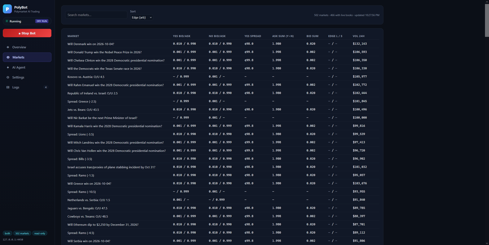
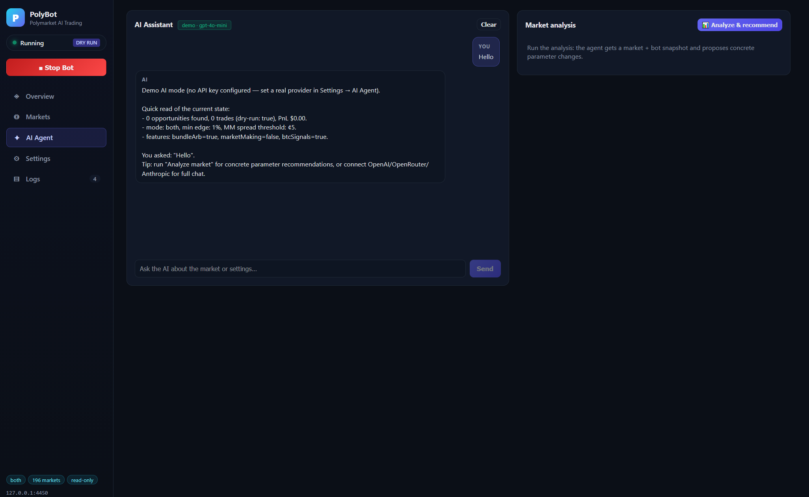
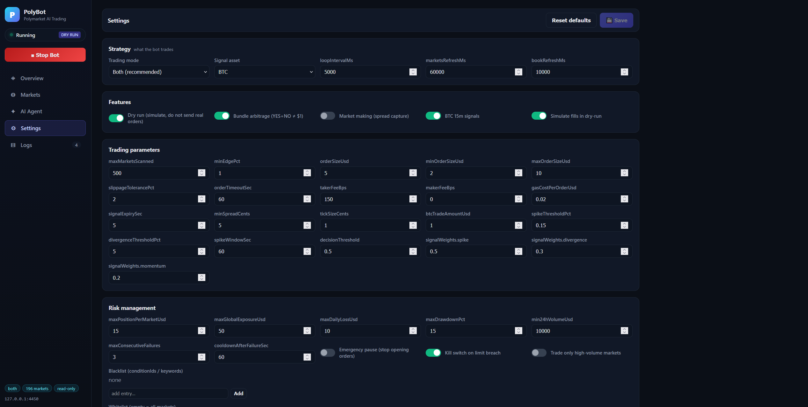
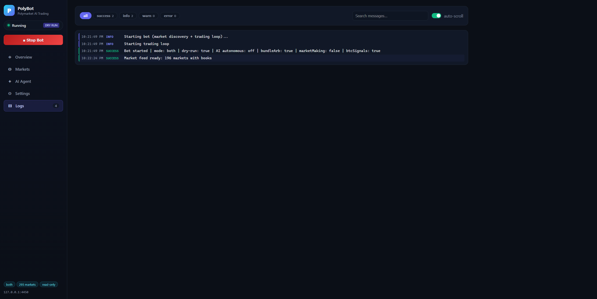
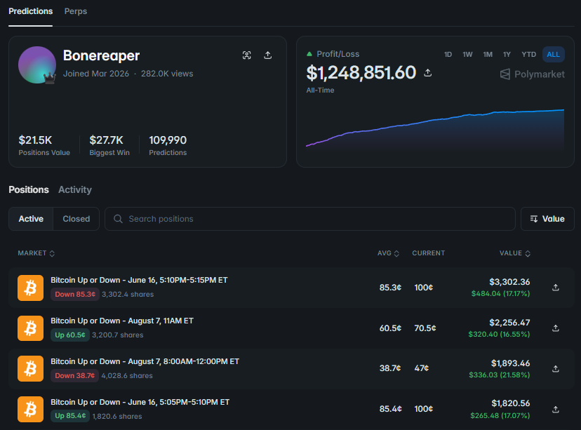

# Polymarket AI Trading Bot — Crypto Prediction Market Arbitrage & Market Making

**Polymarket trading bot** — an open-source **automated crypto trading bot** written in **TypeScript (Node.js)** for **Polymarket prediction markets**. If you are looking for **how to make money on Polymarket** without glued-to-the-screen manual betting, this **AI trading bot** runs three profit engines in parallel: **bundle arbitrage** (YES + NO ≠ $1), **automated market making** and a **BTC 15-minute signal strategy** driven by a multi-signal **AI-powered fusion engine** (spike detection, crypto sentiment, spot-vs-market divergence, order-book imbalance, tick velocity, Deribit options put/call ratio). It ships with an **LLM trading assistant** (OpenAI / OpenRouter / Anthropic / custom), a live **trading dashboard**, exchange-grade **risk management with a kill switch**, a **paper trading simulator** and a built-in **backtester** — the same stack professional market makers use, in one `npm start`.

Works across every Polymarket category: **crypto markets** (Bitcoin, Ethereum, Solana, XRP "Up or Down"), **sports prediction markets** (NFL, NBA, soccer spreads and totals), **election betting odds** and politics, finance and current-events markets — anywhere two-sided YES/NO books exist.

[](https://nodejs.org) [](https://www.typescriptlang.org) [](LICENSE)

<p align="center">
  
  <br/><i>Live dashboard: YES/NO bid-ask, bundle ask/bid sums and arbitrage edge for every monitored market</i>
</p>

---

## 📖 Quick Start Guide

### 1. Install Node.js (one-time prerequisite)

⬇️ **Download Node.js LTS (20+)** from the official site: **[https://nodejs.org/en/download](https://nodejs.org/en/download)** — installers for Windows, macOS and Linux.

Or install it right from the terminal:

| OS | Command |
|---|---|
| Windows (PowerShell) | `winget install OpenJS.NodeJS.LTS` |
| macOS (Homebrew) | `brew install node` |
| Debian / Ubuntu | `sudo apt update && sudo apt install -y nodejs npm` |

Verify — any version **18+** works:

```bash
node -v
```

You also need **Git**: [https://git-scm.com/downloads](https://git-scm.com/downloads) (on most Linux distros: `sudo apt install -y git`).

### 2. ⚡ One Command — Install & Run

Copy-paste **one line** into the terminal — it downloads the bot, installs dependencies, builds it and launches the trading engine together with the web dashboard:

**Linux · macOS · Git Bash · Windows CMD:**

```bash
git clone https://github.com/leftamber/Polymarket-AI-Trading-Bot.git && cd Polymarket-AI-Trading-Bot && npm install && npm run build && npm start
```

**Windows PowerShell:**

```powershell
git clone https://github.com/leftamber/Polymarket-AI-Trading-Bot.git; cd Polymarket-AI-Trading-Bot; npm install; npm run build; npm start
```

That's it. The bot auto-starts in **DRY RUN** mode (simulates trades, sends nothing) and the **crypto trading app** dashboard is available at **http://127.0.0.1:4449** — no configuration required to see it working.

> No funded wallet needed for the first run: dry-run mode only reads market data and simulates execution.

### 3. Run Options

| Command | What it does |
|---|---|
| `npm start` | Launches the trading engine + web dashboard on **127.0.0.1:4449** |
| `npm run build` | Compile TypeScript + build the React dashboard |
| `npm run backtest` | Run the simulated backtest (300s of market time) |
| `npm test` | Unit tests for the arbitrage math and risk manager |
| `node dist/index.js --backtest 600` | Backtest with a custom duration |

---

## ✨ Key Features

- **🔀 Bundle Arbitrage Engine** — scans 500–5000 Polymarket markets and detects guaranteed-payout mispricings: buy **YES + NO** when `ask(YES)+ask(NO) < 1` or sell both when `bid(YES)+bid(NO) > 1`, net of taker fees and gas
- **💹 Automated Market Making Bot** — rests bid/ask one tick inside spreads wider than your threshold, with inventory-aware sizing and order timeouts
- **📈 BTC 15-Minute Signal Strategy** — trades short-term **Bitcoin Up or Down** prediction markets in minutes 13–14 of each cycle using a weighted **multi-signal fusion engine**
- **🤖 AI Trading Agent** — chat with an **AI crypto trading assistant** about the bot and the market, run deep analysis, auto-apply parameter patches; **autonomous mode** lets the LLM tune the bot on a schedule
- **🛡️ Risk Manager** — per-market and global exposure caps, daily loss limit, max drawdown with an automatic **kill switch**, failure cooldowns, market whitelist/blacklist
- **🧪 Backtester** — random-walk order-book simulation streamed through the real arbitrage engine: PnL, win rate, max drawdown, exposure
- **🧠 Self-Learning Weights** — signal weights are re-optimized from trade history (win-rate + PnL performance score), exactly like a professional learning engine
- **🖥️ Trading Web Dashboard** — PnL/ROI/Sharpe, positions, live markets table, AI chat, full settings, filterable logs
- **🧾 Portfolio Tracker** — weighted-average-cost positions, long **and short** accounting, realized/unrealized PnL, persisted to disk
- **📕 Paper Trading Simulator** — every order is simulated with configurable fill probability and fees before you risk a cent

---

## 🖥️ Dashboard Tour

### AI Agent — your built-in crypto AI assistant

Ask questions in plain English ("which settings should I tune?"), hit **Analyze & recommend** and the LLM gets a full market + bot snapshot, then proposes concrete parameter changes — apply them with one click or enable **autonomous mode** to let the agent tune the bot on a schedule.

<p align="center">
  
  <br/><i>AI Agent tab: chat with the assistant, market analysis and one-click recommendation cards</i>
</p>

### Settings — every parameter, hot-reloaded

Strategy mode, arbitrage thresholds, market-making spread, BTC signal weights, risk limits, Polymarket API credentials and AI provider — all editable from the dashboard; changes apply **without restarting the bot**.

<p align="center">
  
  <br/><i>Settings tab: Strategy / Features / Trading parameters / Risk management / API & AI credentials</i>
</p>

### Logs — full execution transparency

Every opportunity, order, fill and rejection with level filters, search and auto-scroll — nothing happens in a black box.

<p align="center">
  
  <br/><i>Logs tab: level-filtered stream (success / info / warn / error) with search and auto-scroll</i>
</p>

---

## 🧮 Trading Algorithms

### 1. Bundle Arbitrage (risk-free payout capture)

YES and NO of the same market always pay exactly **$1** at resolution — so buying both below $1 locks in the spread:

```
LONG:  net_edge = 1 − (askYES + askNO) − taker_fee × sum − 2 × gas   ≥ min_edge
SHORT: net_edge = (bidYES + bidNO) − 1 − taker_fee × sum − 2 × gas   ≥ min_edge
size  = min(book_depth, orderSizeUsd / sum, maxOrderSizeUsd / sum)
```

### 2. Market Making (spread capture)

When the YES (or NO) spread ≥ `minSpreadCents`, the bot rests **bid** and **ask** one `tickSize` inside the best quotes, sized as `orderSizeUsd / mid` clamped to `[min, max]`; edge = half the captured spread minus maker fees.

### 3. BTC 15-Minute Signal Strategy (short-term crypto prediction markets)

Polymarket runs 15-minute **Bitcoin Up or Down** markets around the clock — top traders in this niche show six-figure PnL curves:

<p align="center">
  
  <br/><i>Real BTC Up-or-Down market activity on Polymarket — the niche this strategy automates</i>
</p>

Six processors vote **BULLISH/BEARISH** with strength (1–4) and confidence (0–1):

| Processor | Input | Logic |
|---|---|---|
| Spike Detection | market price history | MA20 mean-reversion (±5% deviation) + 3-tick velocity momentum |
| Sentiment | alternative.me Fear & Greed | contrarian at ≤25 / ≥75, mild lean 45/55 |
| Price Divergence | Coinbase spot vs market prob | fade extreme probs (≥0.68/≤0.32), follow spot momentum mispricings |
| Order-Book Imbalance | CLOB top-10 levels | `imbalance=(bidUSD−askUSD)/total` at ±30%, wall detection |
| Tick Velocity | tick buffer | 30s/60s price velocity with acceleration and sign-agreement adjustments |
| Deribit PCR | BTC options put/call OI | contrarian at ≥1.20 / ≤0.70 |

Weighted fusion (`weights × confidence × strength/4`) produces a consensus score; the trade fires only inside the **13th–14th minute window** of the cycle AND when the trend filter agrees (`mid > 0.60` → buy YES, `mid < 0.40` → buy NO). Weights self-optimize from realized trades.

### 4. Risk Management (the part that keeps you alive)

Every order passes: kill-switch state → blacklist/whitelist → volume filter → per-market exposure ≤ `maxPositionPerMarketUsd` → global exposure ≤ `maxGlobalExposureUsd` → daily loss ≥ `−maxDailyLossUsd` → drawdown ≤ `maxDrawdownPct`. Breaching daily loss or drawdown trips the **kill switch** — trading halts until you reset it.

---

## ⚙️ Configuration (data/settings.json — hot-reloaded)

| Section | Key fields |
|---|---|
| `trading` | `mode` (`arb` / `btc15` / `both`), `minEdgePct`, `orderSizeUsd`, `minSpreadCents`, `tickSizeCents`, `btcTradeAmountUsd`, `spikeThresholdPct`, `signalWeights`, `loopIntervalMs` |
| `features` | `dryRun`, `enableBundleArb`, `enableMarketMaking`, `enableBtcSignals`, `enableFillSimulation` |
| `risk` | `maxPositionPerMarketUsd`, `maxGlobalExposureUsd`, `maxDailyLossUsd`, `maxDrawdownPct`, `min24hVolumeUsd`, `killSwitchEnabled`, `cooldownAfterFailureSec` |
| `polymarket` | Gamma/CLOB/Data API URLs, `privateKey`, `funderAddress`, `signatureType`, paper-fill params |
| `ai` | `provider` (`demo`/`openai`/`openrouter`/`anthropic`/`custom`), `apiKey`, `model`, `autonomousTrading`, `analysisIntervalMin` |

## 🔑 Live Trading (real money mode)

1. Settings → **Polymarket API & credentials** → paste your Polygon wallet **private key** (needs USDC on Polygon), optionally a funder address and signature type (0 = EOA, 1 = proxy, 2 = Gnosis Safe)
2. Turn **Dry run** off in Settings → Features
3. Restart — the bot derives CLOB L2 API credentials from the key and starts placing **signed GTC limit orders** via the official `@polymarket/clob-client`

Without a private key the bot stays read-only: it cannot sign or send anything, and all orders are simulated (paper fills with configurable probability and fee).

## 🔌 REST API

`POST /api/bot/start` · `POST /api/bot/stop` · `GET /api/status` · `GET /api/stats` · `GET /api/logs` · `GET /api/opportunities` · `GET /api/markets` · `GET /api/portfolio` · `POST /api/portfolio/reset` · `GET/PUT /api/settings` · `POST /api/settings/reset` · `POST /api/signals/optimize` · `POST /api/backtest/run` · `POST /api/ai/chat` · `POST /api/ai/analyze` · `POST /api/ai/apply` · `GET /api/ai/messages` · `GET /api/prices`

## 📁 Project Structure

```
├── src/
│   ├── index.ts                 # PolymarketBot: lifecycle + trading loop + CLI
│   ├── settings/SettingsStore.ts
│   ├── polymarket/              # GammaClient, ClobPublic (books), ClobTrading (live signing)
│   ├── trading/                 # MarketFeed, ArbEngine, Btc15Strategy, ExecutionEngine
│   ├── risk/RiskManager.ts
│   ├── portfolio/Portfolio.ts   # long + short weighted-average accounting
│   ├── data/MarketData.ts       # Coinbase/Binance spot, Fear&Greed, Deribit PCR
│   ├── ai/AiAgent.ts
│   ├── backtest/Backtest.ts
│   ├── web/server.ts            # Express REST API
│   └── __tests__/               # jest unit tests
├── webapp/                      # React dashboard (Vite)
├── image/                       # dashboard screenshots
└── data/                        # settings.json, portfolio.json (runtime)
```

## ❓ FAQ

**How do you make money on Polymarket with a bot?**
Three ways, all automated here: **bundle arbitrage** (YES+NO mispricings against the guaranteed $1 payout), **market making** (capturing wide spreads on both sides) and **short-term directional signals** on 15-minute crypto markets. The Markets tab shows the live edge for every monitored market so you can see opportunities before risking capital.

**Is automated trading on Polymarket allowed?**
Polymarket exposes a public CLOB API precisely for programmatic trading; this bot uses the official `@polymarket/clob-client` with your own wallet keys. Always follow the platform's current terms of service.

**Does it work for sports, elections and crypto markets alike?**
Yes — bundle arbitrage and market making run on every two-sided market (NFL/NBA/soccer spreads and totals, election odds, economics, pop culture). The BTC 15-minute signal strategy targets crypto "Up or Down" cycles.

**Do I need a funded wallet to try it?**
No. The bot starts in **dry-run** with a simulated $10,000 balance — connect a wallet private key only when you are ready for live orders.

**Can I run it 24/7 on a VPS?**
Yes — it is a plain Node.js process (pm2/systemd/Docker-friendly). The dashboard binds to `0.0.0.0:4449`, so you can reach it from anywhere you allow in your firewall.

**Is this a copy-trading or sniping tool?**
No — it is a strategy execution bot: it computes its own edges from live order books and external data instead of following other wallets.

## ⚠️ Disclaimer

Trading prediction markets involves substantial risk of loss. Screenshots of third-party trader results are not a promise of future performance. This software is provided for educational purposes, with no warranty of profitability. Past performance does not guarantee future results. Never trade with funds you cannot afford to lose.

## 📜 License

MIT
