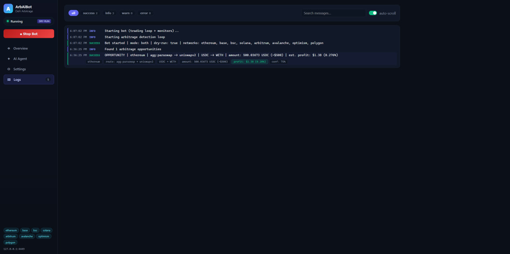
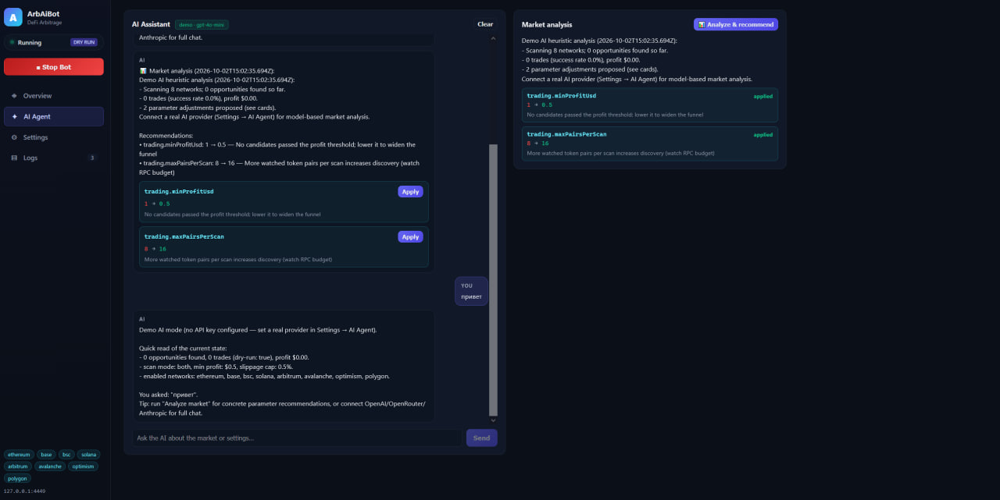

<div align="center">

# 🤖 ArbAiBot - Free AI Trading Bot for DeFi Arbitrage

### AI-Powered Automatic Trading Bot · MEV Bot Arbitrage · Cross-Chain Arbitrage · Multi-DEX Crypto Trading App

[](https://nodejs.org)
[](https://www.typescriptlang.org)
[](#web-dashboard-crypto-trading-app)
[](#license)
[](#supported-networks--dexes)
[](#supported-networks--dexes)

**ArbAiBot** is an open-source **AI trading bot** that scans 8 blockchain networks and 10+ DEXes 24/7 to find and execute **arbitrage cryptocurrency** opportunities automatically — an **AI DEX bot** with mempool (**MEV bot arbitrage**) monitoring, **cross-chain arbitrage**, flash-loan support, multi-wallet management and a built-in React **crypto trading app** dashboard.

[⬇️ Download & Quick Start](#quick-start-guide) · [🖼 GUI Screenshots](#gui-overview-screenshots) · [🤖 AI Automatic Trading](#ai-agent--automatic-trading-mode) · [👛 Multi-Wallet](#wallet-settings-multi-wallet-management) · [🏗 Architecture](#technical-architecture) · [❓ FAQ](#faq)

</div>

---

## 📑 Table of Contents

1. [Why ArbAiBot](#why-arbaibot)
2. [GUI Overview — Screenshots](#gui-overview-screenshots)
3. [Features](#features)
4. [Supported Networks & DEXes](#supported-networks--dexes)
5. [Quick Start Guide](#quick-start-guide)
6. [Web Dashboard — Crypto Trading App](#web-dashboard-crypto-trading-app)
7. [AI Agent & Automatic Trading Mode](#ai-agent--automatic-trading-mode)
8. [Wallet Settings — Multi-Wallet Management](#wallet-settings-multi-wallet-management)
9. [MEV & Mempool Arbitrage](#mev--mempool-arbitrage)
10. [Cross-Chain Arbitrage](#cross-chain-arbitrage)
11. [Flash Loans](#flash-loan-arbitrage)
12. [Risk Management](#risk-management)
13. [Technical Architecture](#technical-architecture)
14. [Configuration Reference](#configuration-reference)
15. [FAQ](#faq)
16. [SEO Keywords](#keywords)
17. [Disclaimer](#disclaimer)
18. [License](#license)

---

## Why ArbAiBot

Most **crypto bots trading** tools are black boxes or paid subscriptions. ArbAiBot is a fully open-source, self-hosted **AI crypto trading bot** that you control: your keys, your RPC nodes, your rules.

| | Typical paid bot | ArbAiBot |
|---|---|---|
| Price | $50–$500/mo subscription | **Free & open source (MIT)** |
| Keys & custody | Often third-party | **Your wallets, your server** |
| AI setting optimization | ✗ | **✅ Built-in AI agent with automatic trading mode** |
| Multi-wallet with per-wallet settings | ✗ | **✅ Wallet tabs, seed/private key storage, MetaMask binding** |
| Chains | 1–3 | **8 networks (EVM + Solana)** |
| DEX coverage | Fixed | **Any Uniswap V2-style / V3 / aggregator — add your own in 1 minute** |
| UI | Web or none | **Full React dashboard, live logs, AI chat** |

Whether you are looking for an **app for crypto trading** that runs headlessly on a VPS, or an **AI DEX bot** you can extend with your own strategies — ArbAiBot gives you both the engine and the cockpit.

---

## GUI Overview (Screenshots)

### Live Logs — Arbitrage Opportunities in Real Time
The bot streams every detected **arbitrage cryptocurrency** opportunity with route, amount and estimated profit (Live POC):



### AI Agent - Market Analysis & One-Click Recommendations
Built-in **AI trading assistant** analyzes the market snapshot and proposes concrete settings changes you can apply with one click, or let it apply them itself in **automatic trading** mode:



### Trading Settings - Full Control Over the Trading App
Trade amounts, profit thresholds, gas strategy, engine feature switches and the AI agent configuration — everything editable live, no restart needed:


### Networks & Protocols - Your Own "Best Exchange" Mix
Add RPC nodes, watched tokens, DEX factories/routers and aggregator quote sources per network. Build your own routing across the **best crypto coin exchange** contracts:


### Wallet Settings - Multi-Wallet Management
Wallet tabs (`★ Wallet 1`, `+` to add), generate / import / MetaMask connect, private key & seed phrase storage, and **per-wallet trading settings**:


---

## Features

**🔍 Arbitrage Engine (AI DEX Bot core)**
- Same-chain **DEX arbitrage** — cross-DEX round trips (e.g. Uniswap V2 → SushiSwap → back)
- **MEV bot arbitrage** — mempool scanning of pending swaps for early signals
- **Cross-chain arbitrage** — Wormhole, deBridge, Across, LayerZero/Stargate, Axelar bridge framework
- **Flash-loan arbitrage** — Aave V3, Morpho, Spark; collateral-free capital
- **Perp/funding-rate arbitrage** — Hyperliquid, GMX framework
- Aggregator quote sources: 1inch, OpenOcean, ParaSwap, Jupiter (Solana), custom endpoints
- Live USD valuation of every pair via a built-in **price oracle** (DefiLlama / CoinGecko / custom)

**🤖 AI Trading Bot**
- Connect **OpenAI, OpenRouter, Anthropic or any OpenAI-compatible LLM** (or run keyless demo heuristics)
- Chat with the bot about the market and its own configuration
- **Automatic trading mode** — the AI agent autonomously re-tunes settings (profit threshold, slippage, risk limits, active wallet) to keep catching profitable opportunities
- One-click "Analyze market" with concrete, reviewable recommendations

**👛 Multi-Wallet Management**
- Unlimited wallet tabs — every wallet keeps **its own trading settings**
- **Generate new wallets** (address + private key + BIP-39 seed phrase)
- **Import** existing keys / seed phrases
- **MetaMask binding** — attach settings to a specific MetaMask account
- Per-wallet: amounts, min profit, slippage, gas, allowed networks, dry-run-only flag

**📊 Crypto Trading App Dashboard**
- Real-time stats: profit, trades, success rate, ROI, daily PnL, equity curve chart
- Live log stream with level filters and search
- Start/stop engine, live hot-reloading settings (no restarts)
- Built with React + Vite, dark UI

**🛡 Risk Management**
- Min profit & min liquidity thresholds, max slippage, max gas price
- Daily loss limit, consecutive-failure limit, cooldown after failure
- Kill-switch drawdown, take-profit / stop-loss, emergency pause
- Token blacklist, honeypot checks, **dry-run simulation mode**

---

## Supported Networks & DEXes

*Best exchange for crypto* coverage — use ArbAiBot as a **platform for trading cryptocurrency** across the deepest-liquidity chains:

| Network | Chain ID | Native | Default DEXes |
|---|---|---|---|
| Ethereum | 1 | ETH | Uniswap V2, Uniswap V3 |
| Base | 8453 | ETH | Uniswap V3, Aerodrome |
| BSC | 56 | BNB | PancakeSwap V2, PancakeSwap V3 |
| Arbitrum | 42161 | ETH | Uniswap V3, Camelot, GMX |
| Avalanche | 43114 | AVAX | Trader Joe |
| Optimism | 10 | ETH | Uniswap V3, Velodrome |
| Polygon | 137 | MATIC | QuickSwap, SushiSwap, Uniswap V3 |
| Solana | — | SOL | Jupiter aggregator (via SolanaConnector) |

**Supported DEX types (add your own factory/router in the dashboard):**
`uniswapv2` · `uniswapv3` · `pancakeswap` · `quickswap` · `sushiswap` · `aerodrome` · `velodrome` · `traderjoe` · plus aggregator quote sources: **OpenOcean · 1inch · ParaSwap · custom REST API**.

> Because any Uniswap V2-fork can be added by pasting a factory + router address, ArbAiBot effectively supports **every best crypto coin exchange** venue on these chains.

---

## Quick Start Guide

### Requirements
- **Node.js 18+** (Node 20 recommended)
- An RPC endpoint per network you want to trade (free public RPCs work; private nodes like Alchemy/QuickNode/Ankr are better for MEV scanning)
- Funded wallet(s) — or just run in **dry-run** mode first (default!)

### 1. Clone & Install
```bash
git clone https://github.com/leftamber/ai-trading-bot.git
cd arb-ai-bot
npm install
```

### 2. (Optional) Create `.env` for RPC keys & fallback wallets
```env
# RPC nodes (bot settings UI overrides these)
ETHEREUM_RPC_URL=https://ethereum-rpc.publicnode.com
BASE_RPC_URL=https://mainnet.base.org
BSC_RPC_URL=https://bsc-dataseed.binance.org/
SOLANA_RPC_URL=https://api.mainnet-beta.solana.com
ARBITRUM_RPC_URL=https://arb1.arbitrum.io/rpc
AVALANCHE_RPC_URL=https://api.avax.network/ext/bc/C/rpc
OPTIMISM_RPC_URL=https://mainnet.optimism.io
POLYGON_RPC_URL=https://polygon-rpc.com

# Fallback wallet keys (preferred: add wallets in the dashboard → Wallet Settings)
PRIVATE_KEY_ETHEREUM=0x...
PRIVATE_KEY_BASE=0x...

# AI provider (preferred: configure in the dashboard → AI Agent)
OPENAI_API_KEY=sk-...

# Dashboard port
DASHBOARD_PORT=4449
```

### 3. Build & Run
```bash
npm run build      # compiles server (tsc) + dashboard (vite)
npm start          # starts the bot + web dashboard
```

For development with hot reload:
```bash
npm run dev        # run the bot via ts-node
npm run dev:web    # vite dev server for the dashboard
```

### 4. Open the Dashboard
Open **http://127.0.0.1:4449** — the built-in **crypto trading app** UI.
The bot starts in **DRY RUN** mode by default (simulates trades, sends nothing).

### 5. First-Run Checklist
1. **Settings → Networks & Protocols** — check RPC URLs, enable the networks you want
2. **Settings → Wallet Settings** — press **`+` → Create New Wallet**: generate, import, or connect MetaMask
3. **Settings → AI Agent** — pick a provider (demo works with zero config) and optionally enable **🤖 Enable Automatic**
4. Press **▶ Start Bot** and watch live opportunities in the Logs tab
5. When you are confident — turn **Dry run OFF** to enable real execution

---

## Web Dashboard (Crypto Trading App)

Four tabs, all live:

| Tab | What you get |
|---|---|
| **◈ Overview** | Profit, trades, success rate, ROI, daily PnL, equity curve, enabled networks, wallet balances, recent opportunities |
| **✦ AI Agent** | Chat with the bot, "Analyze market", recommendation cards with **Apply** buttons, autonomous mode status |
| **⚙ Settings** | Trading / Features / Flash Loans / AI / Oracle / Risk / Networks / **Wallet Settings** — everything editable live |
| **▤ Logs** | Real-time log stream, level filters (success / info / warn / error), search |

All settings changes are **hot-reloaded** — the trading loop rebuilds DEX connectors, signers and AI schedules without restarting the process.

---

## AI Agent & Automatic Trading Mode

The built-in **AI trading bot** is the brain of ArbAiBot:

### Providers
| Provider | Notes |
|---|---|
| `demo` | Local heuristic engine — no API key needed, works offline |
| `openai` | api.openai.com/v1 (GPT models) |
| `openrouter` | openrouter.ai/api/v1 — hundreds of models, one key |
| `anthropic` | Claude models |
| `custom` | Any OpenAI-compatible endpoint (Ollama, LM Studio, vLLM…) |

### What the AI receives
A live market snapshot: bot stats, recent opportunities, network/protocol inventory, risk state, wallet fleet summary.

### What the AI can change
`trading.*` (amounts, min profit, slippage, scan mode, pairs per scan), `features.*` (engine switches), `flashloan.*`, `risk.*`, and `wallets.activeId` (switch the trading wallet).

### 🤖 Enable Automatic — Autonomous Trading
The **Enable Automatic** toggle in *Settings → AI Agent* grants the agent full autonomy:

- ✅ **The AI changes bot settings by itself** — no manual approval per recommendation
- ✅ Scheduled market analysis runs automatically (**every 5 min** by default, or your own interval)
- ✅ The bot continuously finds opportunities and **executes profitable trades automatically**
- ⚠️ Combine with Risk Management limits and, if you want extra safety, keep `Dry run` ON or mark a wallet as **Dry-run only**

Without automatic mode, every AI recommendation waits for your **Apply** click.

---

## Wallet Settings (Multi-Wallet Management)

Open **Settings → Wallet Settings** at the top of the page. You get a tab bar:

```
[ ★ Wallet 1 ] [ Wallet 2 ] [ + ]
```

- **`+` → Create New Wallet** opens a modal with three modes:
  - **⚡ Generate new** — creates an address + private key + 12-word seed phrase, with copy buttons; everything is stored to the wallet entry
  - **📥 Import** — paste an existing address, private key or seed phrase
  - **🦊 MetaMask** — one-click connect via `window.ethereum`: the wallet's settings are bound to your MetaMask account; switch accounts in MetaMask and re-connect to rebind. For fully automatic signing, paste the private key exported from MetaMask (Account details → Export private key)
- **Every wallet tab has its own settings** that override global Trading settings when that wallet is active:
  - Trade amount (native / USD / stable), min profit, max slippage, gas price, gas limit, tx deadline
  - **Allowed networks** — restrict which chains this wallet may trade
  - **Dry-run only** — this wallet never sends real transactions
- **★ Active trading wallet** — click "Set as active wallet" on any tab; the trading engine instantly signs with this wallet's credentials (private key, or key derived from seed phrase)
- Keys and seed phrases are stored **locally** in `data/settings.json` — nothing is ever sent to third-party servers (AI requests contain market data only, never your keys)

---

## MEV & Mempool Arbitrage

ArbAiBot includes a **mempool monitor** — the classic MEV bot building block:

- Subscribes to pending transactions on every enabled network (dedicated mempool RPC supported per network)
- Decodes pending swap calls (V2 `swapETHForExactTokens` / `swapTokensForExactTokens` and friends)
- Feeds observed token pairs back into the quote scanner for early opportunity discovery
- Configurable buffer size per network (`maxPendingTxPerNetwork`) and scan mode: `mempool` / `pools` / `both`

> Real MEV extraction (sandwiching, backrunning) is **not** enabled by default — the scanner uses mempool data as an *early signal* for arbitrage routes. Always respect chain-specific regulations and mempool etiquette.

---

## Cross-Chain Arbitrage

The cross-chain layer ships with connectors and addresses for:

- **Wormhole** (Ethereum ⇄ Solana core bridge)
- **deBridge**, **Across**, **LayerZero / Stargate**, **Axelar** (config ready per chain)
- **SolanaConnector** for Solana-side execution (Jupiter aggregator program)

Enable it with **Features → Enable Crosschain**. Cross-chain opportunities are detected when price divergence between chains exceeds fees — a classic **cross-chain arbitrage** strategy used by professional **crypto bots trading** desks.

---

## Flash Loan Arbitrage

Enable **Features → Enable Flash Loans** to trade without idle capital:

- Providers: **Aave V3**, **Balancer**, **DODO**
- Configurable max loan (USD), provider fee (bps), auto-repay from proceeds
- The bot bundles borrow → arb legs → repay into a single atomic transaction

---

## Risk Management

| Guard | Setting |
|---|---|
| Emergency pause (global stop) | `risk.emergencyPause` |
| Min pool liquidity (USD) | `risk.minLiquidityUsd` |
| Max daily loss (USD) | `risk.maxDailyLossUsd` |
| Max consecutive failures | `risk.maxConsecutiveFailures` |
| Cooldown after failure (sec) | `risk.cooldownAfterFailureSec` |
| Max gas price (Gwei) | `risk.maxGasPriceGwei` |
| Max trade size (USD) | `risk.maxTradeAmountUsd` |
| Take profit / Stop loss (USD) | `risk.takeProfitUsd` / `risk.stopLossUsd` |
| Kill-switch drawdown (%) | `risk.killSwitchDrawdownPct` |
| Token blacklist | `risk.blacklistTokens` |
| Honeypot check | `risk.honeypotCheck` |
| Dry run (simulate only) | `features.dryRun` |

Every candidate opportunity passes this gauntlet before a transaction is built. Failed trades trigger cooldowns; the kill-switch halts trading on drawdown.

---

## Technical Architecture

```
┌────────────────────────────────────────────────────────────────┐
│                       React Dashboard (Vite)                   │
│        Overview · AI Agent · Settings (+ Wallets) · Logs       │
└──────────────────────────────┬─────────────────────────────────┘
                               │ REST API (Express, :4449)
┌──────────────────────────────┴─────────────────────────────────┐
│                        WebServer (src/web)                     │
│  /api/stats /api/logs /api/settings /api/wallets /api/ai/*     │
└──────────────────────────────┬─────────────────────────────────┘
┌──────────────────────────────┴─────────────────────────────────┐
│                        ArbAiBot (src/index)                    │
│   trading loop · hot-reload · stats · AI schedule · logging    │
└───┬──────────────┬───────────────┬──────────────┬──────────────┘
    │              │               │              │
┌───┴─────┐  ┌─────┴─────┐  ┌──────┴─────┐  ┌─────┴─────────┐
│ Mempool │  │ Arbitrage │  │Transaction │  │ RiskManager   │
│ Monitor │→ │ Detector  │→ │ Executor   │← │ (kill switch, │
│ (MEV)   │  │ (+oracle) │  │ (signers,  │  │  cooldowns)   │
└─────────┘  └───────────┘  │  wallets)  │  └───────────────┘
                            └────────────┘
┌────────────────────────────────────────────────────────────────┐
│  SettingsStore (data/settings.json, versioned, hot-reloaded)   │
│  trading · features · flashloan · risk · oracle · ai · wallets │
│  networks: { rpc, mempoolRpc, tokens, dexes[], aggregators[] } │
└────────────────────────────────────────────────────────────────┘
```

### Source layout
```
src/
├── index.ts               # ArbAiBot orchestrator + trading loop
├── config.ts              # legacy env config (NETWORKS, WALLETS, bridges)
├── settings/
│   └── SettingsStore.ts   # live settings + wallet management + getEffective()
├── web/server.ts          # Express REST API + static dashboard
├── dex/                   # UniswapV2, UniswapV3, PancakeSwap, Aerodrome,
│                          # TraderJoe, Velodrome, QuickSwap, SushiSwap…
├── trading/
│   ├── ArbitrageDetector.ts    # opportunity scanning & scoring
│   └── TransactionExecutor.ts  # tx building, signing, wallet selection
├── mempool/MempoolMonitor.ts   # pending tx stream + swap decoding
├── risk/RiskManager.ts         # pre-trade guards, kill switches
├── crosschain/                 # Wormhole, Solana connectors
└── ai/
    ├── AiAgent.ts       # chat, analysis, autonomous patching
    └── PriceOracle.ts   # DefiLlama / CoinGecko / custom USD prices
webapp/src/              # React dashboard (Overview, AiChat, Settings, Logs)
```

### Tech stack
**Node.js + TypeScript + ethers v6** (backend) · **React 18 + Vite** (dashboard) · **Express 5 + Helmet** (API) · **Winston** (rotating logs) · **Jest** (tests).

---

## Configuration Reference

Two layers of configuration, both hot-reloaded:

1. **Dashboard (recommended)** — *Settings* page writes `data/settings.json`; changes apply within one loop iteration
2. **Environment (`.env`)** — RPC URLs, fallback private keys, bootstrap values (see [Quick Start](#quick-start-guide))

Key `data/settings.json` sections:

| Section | Contents |
|---|---|
| `trading` | amounts, `minProfitUsd`, `maxSlippagePct`, `maxPathLength`, gas, `deadlineSec`, `loopIntervalMs`, `scanMode`, `maxPairsPerScan` |
| `features` | mempool monitor, crosschain, flash loans, perp arb, concentrated liquidity, `dryRun` |
| `flashloan` | provider, max amount, fee, auto-repay |
| `risk` | see [Risk Management](#risk-management) |
| `oracle` | provider (`defillama` / `coingecko` / `custom`), base URL, key, cache TTL |
| `ai` | provider, model, API key/base URL, temperature, `analysisIntervalMin`, `autoApplyRecommendations`, **`autonomousTrading`** |
| `wallets` | `activeId` + `list[]` — each with address, privateKey, seedPhrase, `settings` overrides, `allowedNetworks`, `dryRunOnly` |
| `networks` | per chain: `enabled`, `rpcUrl`, `mempoolRpcUrl`, `pollIntervalMs`, `tokens[]`, `dexes[]` (factory/router), `aggregators[]` |

### REST API (for scripting & integrations)
```
GET  /api/status · /api/stats · /api/logs?limit&level · /api/opportunities
GET  /api/settings                PUT /api/settings               POST /api/settings/reset
GET  /api/wallets                 POST /api/wallets               POST /api/wallets/generate
PUT  /api/wallets/:id             DELETE /api/wallets/:id         POST /api/wallets/:id/activate
GET  /api/ai/status               GET  /api/ai/messages           POST /api/ai/chat
POST /api/ai/analyze              POST /api/ai/apply              DELETE /api/ai/messages
GET  /api/prices                  GET  /api/networks              GET /api/meta
```

---

## FAQ

<details>
<summary><b>Is this AI trading bot free?</b></summary>
Yes — ArbAiBot is 100% open source under MIT. No subscriptions, no revenue share. You pay only your own gas and optional LLM API costs (the <code>demo</code> AI mode is free).
</details>

<details>
<summary><b>Can the AI really trade automatically?</b></summary>
Yes. Enable <b>Settings → AI Agent → 🤖 Enable Automatic</b>. The agent then analyzes the market on a schedule, applies its own settings changes, and the trading loop executes the best profitable opportunities it finds. For maximum safety, start with <code>Dry run</code> ON.
</details>

<details>
<summary><b>Do I need an API key for the AI?</b></summary>
No. The built-in <code>demo</code> provider runs local heuristics with zero configuration. Connect OpenAI / OpenRouter / Anthropic (or any OpenAI-compatible endpoint like a local LLM) for model-quality analysis.
</details>

<details>
<summary><b>How is this different from other crypto trading apps?</b></summary>
It is a self-hosted arbitrage engine + AI agent + dashboard in one. You keep custody of keys, choose your own RPC nodes, add any DEX by factory/router address, and manage multiple wallets with individual settings — something hosted crypto trading apps rarely allow.
</details>

<details>
<summary><b>Which wallet types are supported?</b></summary>
Generated wallets (built-in BIP-39 generator), imported private keys / seed phrases, and MetaMask-bound accounts. Every wallet keeps its own trading settings and can be restricted to specific networks or dry-run-only mode.
</details>

<details>
<summary><b>Where are private keys and seed phrases stored?</b></summary>
Locally in <code>data/settings.json</code> on the machine running the bot. They are never transmitted to any external service; AI prompts contain only market statistics. Keep the file safe and use a dedicated server.
</details>

<details>
<summary><b>Does it support MEV / sandwich strategies?</b></summary>
The mempool monitor decodes pending swaps and uses them as early signals for arbitrage routing (the core of MEV bot arbitrage). Aggressive sandwiching is not implemented by default.
</details>

<details>
<summary><b>Which chains are supported?</b></summary>
Ethereum, Base, BSC, Arbitrum, Avalanche, Optimism, Polygon (EVM) plus Solana (via connector/Jupiter). Any new EVM chain works by adding an RPC URL and DEX addresses in the dashboard.
</details>

<details>
<summary><b>Can I add my own DEX?</b></summary>
Yes — Settings → Networks & Protocols → <b>+ Add protocol</b>: choose an implementation type (any Uniswap V2 fork / V3), paste factory + router, enable. Aggregator quote sources (OpenOcean / 1inch / ParaSwap / custom REST APIs) can be added the same way.
</details>

<details>
<summary><b>Will it make money?</b></summary>
No guarantee, ever. Arbitrage is competitive: profit depends on RPC quality, gas costs, competition and market conditions. Always start in dry-run, use small amounts, and read the disclaimer.
</details>

---

## Keywords

`ai trading bots` · `crypto bots trading` · `arbitrage cryptocurrency` · `crypto trading apps` · `app for crypto trading` · `best exchange for crypto` · `best crypto coin exchange` · `platform for trading cryptocurrency` · `automatic trading` · `ai dex bot` · `ai trading bot` · `mev bot arbitrage` · `cross-chain arbitrage` · `trading app` · `defi arbitrage bot` · `dex arbitrage` · `flash loan arbitrage` · `mempool bot` · `uniswap arbitrage bot` · `pancakeswap bot` · `multi-wallet trading` · `crypto trading dashboard` · `open source trading bot` · `solana arbitrage` · `base chain arbitrage` · `bnb chain bot` · `ethereum bot` · `llm trading agent` · `gpt trading bot` · `auto profit bot`

---

## Disclaimer

**This software is provided for educational and research purposes only.** Trading cryptocurrencies, executing arbitrage and interacting with DeFi protocols involves substantial risk of financial loss. Nothing in this repository constitutes financial advice.

- You are solely responsible for anything the bot does with your wallets — **start in dry-run mode**, test on small amounts, and never risk funds you cannot afford to lose
- Private keys and seed phrases stored in `data/settings.json` are plain-text local files — secure your machine
- Automated/AI-driven trading can misconfigure itself; the autonomous mode is provided **as is** — monitor the dashboard
- The authors and contributors are **not liable** for any financial losses, liquidations, MEV penalties, or regulatory issues arising from the use of this software

Use responsibly and in accordance with the laws of your jurisdiction.

---

## License

MIT © ArbAiBot contributors

<div align="center">

**⭐ Star this repository if you find it useful — it helps other traders discover the project!**

</div>
